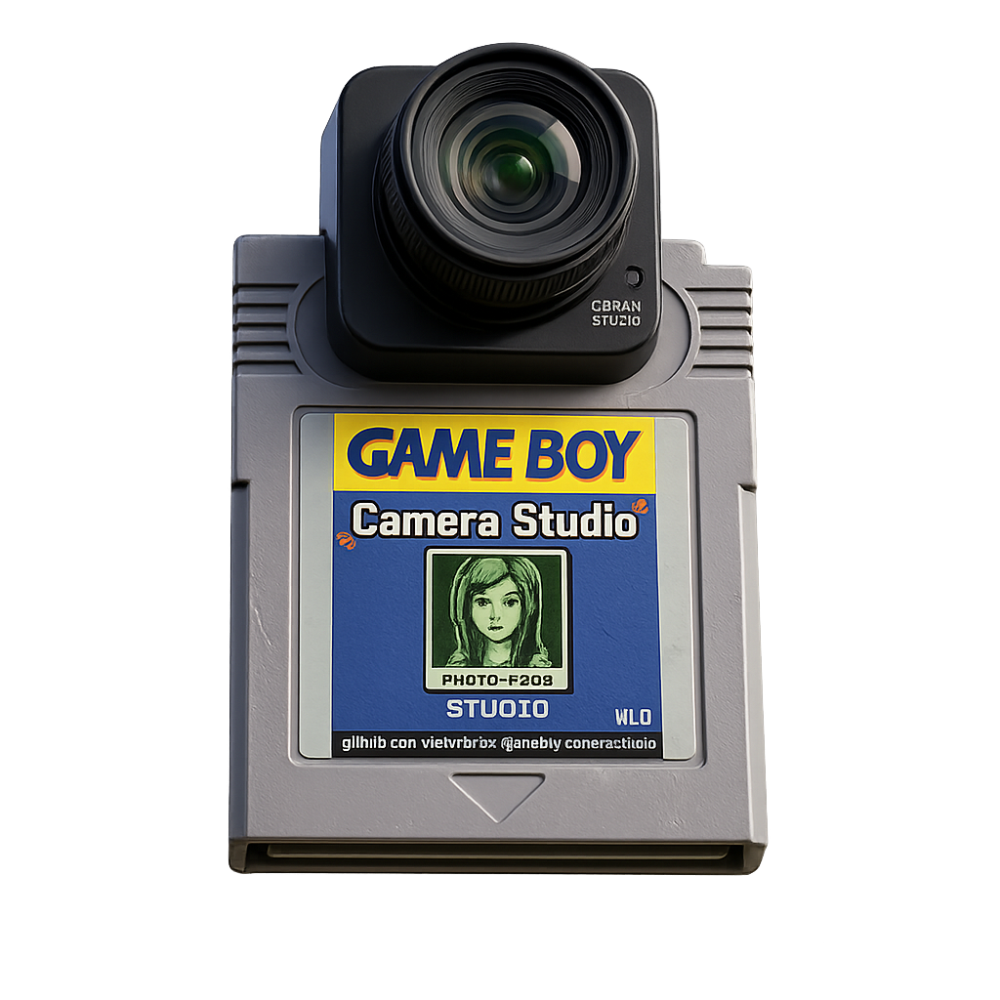
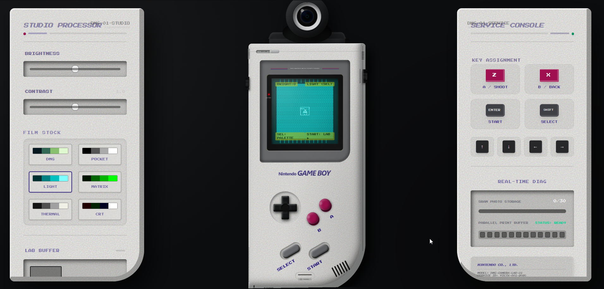

<h1>Game Boy Camera Studio</h1>

Turn your webcam into a **Game Boy Camera.**

A browser-based recreation of the iconic **1998 Game Boy Camera workflow** —  
capture, develop, and print — inside a tactile, mechanical-inspired interface.

  

> **Live Demo**  
> victxrlarixs.github.io/gameboy-camera-studio

---

Game Boy Camera Studio recreates the **tactile photography workflow** of the original hardware.

Instead of being just a filter, the project simulates the **entire photographic ritual**:

**capture → develop → print**

  

---

# Workflow

## Capture

A minimal **LCD-style interface** simulates the original Game Boy camera sensor.

Every frame becomes a **2-bit dithered image**, recreating the visual limitations of the original hardware.

---

## Develop

Enter the **Studio Panel** to refine the shot.

Features include:

- Film palettes  
- Brightness / contrast sliders  
- Real-time dithering preview  
- Live film strip navigation  

This stage mimics the feeling of **developing film inside a digital darkroom**.

---

## Print

The Game Boy slides away and the **thermal printer takes over**.

### Printer Capture

You hear the motor, feel the vibration, and watch the image **appear line by line**, just like a real receipt printer.

---

## Final Print

Press **CUT** to tear the paper and reveal the final artifact.

### Final Photo Result

The image is exported as a **pixel-perfect 8× upscale (1280 × 1152)** while preserving the authentic Game Boy aesthetic.

---

# Mobile Ready

The experience adapts seamlessly to **pocket-sized interaction** while preserving the illusion of a physical object.
