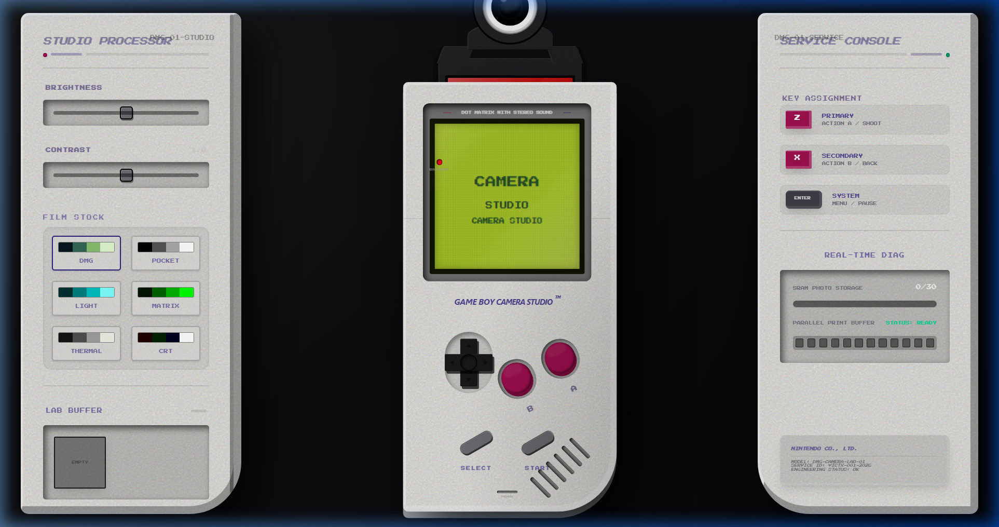
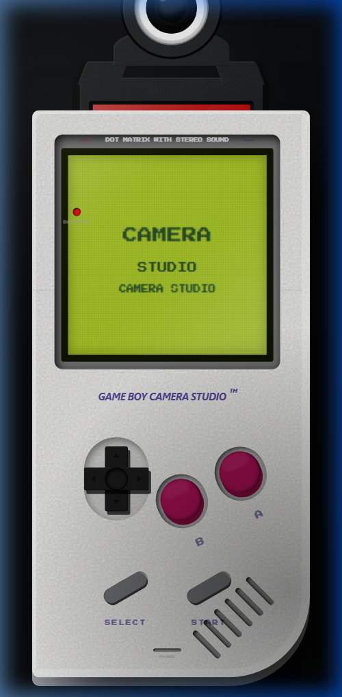

# Game Boy Camera Studio
### *A Tactile Sensory Journey into 8-Bit Photography*

> **Direct Access**: [victxrlarixs.github.io/gameboy-camera-studio](https://victxrlarixs.github.io/gameboy-camera-studio)  

Game Boy Camera Studio is designed to transform the act of digital photography into a tactile, mechanical experience that honors the 1998 classic hardware.

---

## The Experience Workflow

The Studio is built around a "Hardware-First" philosophy. Every interaction is designed to feel like moving physical parts on a professional laboratory workbench.

### 1. The Capture (Hardware Phase)
Hold the device. See the "eye" of the camera. The interface is a stripped-back, high-contrast LCD. When you snap a photo, you aren't just saving data—you're capturing a raw dithered frame with the soul of a 2-bit sensor.

### 2. The Development (Darkroom Phase)
Slide into the **Studio Panel**. Here, you select your "Film Stock" (Palettes) and refine the development.
*   **Tactile Controls**: Adjust brightness and contrast through industrial-grade sliders.
*   **Film Strips**: Watch your lab roll grow as you capture negatives in real-time.

### 3. The Print (Mechanical Phase)
The most magical part of the journey. Once you initiate a print, the Game Boy unit slides away on mechanical rails to make room for the **Thermal Printer**.
*   **Sensory Immersion**: Hear the low-frequency drone of the printing motor.
*   **Physical Feedback**: Feel the vibration of the machine as the paper slowly emerges from the tinted acrylic cover.
*   **Thermal Realism**: Watch the image appear on dithered thermal paper, complete with micro-scanlines and paper grain.

### 4. The Tear (The Final Result)
The process ends with the physical act of "cutting" the paper. Press the debossed, magenta **CUT** button to trigger the tear animation. You are presented with a digital "Print Preview" on a matte plastic tray, ready to be saved as an **8x Upscaled (1280x1152)** pixel-perfect artifact.

---

## Industrial Design Language

We moved away from modern web conventions to embrace **Industrial Nintendo Aesthetics**:
*   **Matte ABS Plastic**: Every panel has the weight and texture of a DMG-01 console.
*   **Debossed Wells**: Controls sit inside recessed cavities for a high-fidelity hardware look.
*   **Mechanical Rails**: Transitions between hardware units are snappy, horizontal slides—no "web magic," just rails and motors.
*   **High-Fidelity Audio**: Procedurally synthesized hardware clicks and motor hums provide constant acoustic feedback.

---

## Designed for Your Pocket
Whether on Desktop or Mobile, the Studio adapts to keep the hardware at the center of your focus.

  
   
  <em>Optimized for perfect centering and tactile reach on all touchscreens</em>

---

*“Bringing the weight and soul of 1998 hardware to the modern browser.”*